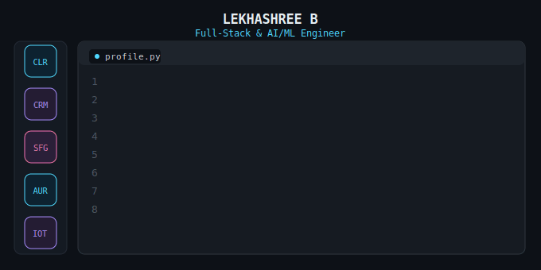

  

# Hi there, I'm Lekhashree B 👋

  

---

## 🎓 About Me

- 💼 **Full-Stack Development Intern @ Thiranex** — shipping production features with React.js, Next.js, Node.js & MongoDB
- 🏫 Final Year **Electronics & Communication Engineering** @ VSB Engineering College, Tamil Nadu (2027) — CGPA 7.76
- 🤖 Build independent AI/ML products — from an ML cybercrime-prediction system to an AI communication-assessment agent powered by Gemini
- 🏆 Smart India Hackathon (SIH) 2024 & 2025 — participated
- 📝 IEEE paper presentation — Smart Memory Aid Watch (GCSAISD 2025)
- 📍 Erode, Tamil Nadu, India

---

## 🛠️ Tech Stack

**Languages**

**Web & App Development**

**Database, AI & Cloud**

**Tools**

---

## 🏆 Achievements & Certifications

| Category | Details |
|---|---|
| 🔥 LeetCode | **360+ Problems Solved** \| 123 Easy · 160 Medium · 77 Hard \| Max Streak: 74 Days |
| 🥇 HackerRank | Gold Badge — Consistent Performer |
| 🏅 TCS CodeVita S13 | Global Rank 9759 |
| 🏅 Smart India Hackathon | SIH 2024 & 2025 — Internally Shortlisted |
| ☁️ Certifications | AWS Cloud Practitioner Essentials · Salesforce Agentforce Champion (Gold) · Generative AI Fluency — Future Skills Prime (Gold) · Google AI Essentials |
| 🎓 Paper Presentations | GCSAISD 2025 (IEEE) · GCT Coimbatore · SREC |

---

## 📌 Featured Projects

### 🩺 [Clario — AI Communication Assessment Agent](https://github.com/lekhashree21/clario)
> Scores voice recordings on clarity, filler words, speaking pace (WPM) & grammar using Gemini's multimodal audio analysis (~5s median). Includes STAR-method detection and a 4-round adaptive mock-interview mode.
> **Tech:** FastAPI • React • MongoDB • Google Gemini

### 🔍 [CrimeTrace AI — Cybercrime Prediction System](https://github.com/lekhashree21/CrimeTrace-AI-SIH)
> Random Forest classifier predicting cybercrime cash-withdrawal hotspots, served via a Flask REST API to a Flutter app for real-time police alerting.
> **Tech:** Python • Random Forest • Flask • Flutter • REST API

### 🛡️ [SafeGuard — Women Safety Application](https://github.com/lekhashree21/safeguard-app)
> Solo-built and deployed women-safety app — real-time emergency alerts, live location tracking, incident documentation.
> **Tech:** Next.js • React • Vercel

### ✅ TaskFlow AI — Full-Stack Task Manager *(coming soon)*
> Secure task manager with JWT auth and protected REST routes; MongoDB Atlas schema designed to scale to hundreds of thousands of tasks per user.
> **Tech:** Next.js • React • TypeScript • Node.js • MongoDB Atlas • JWT

### 🌌 [Aurora AI Poem Generator](https://github.com/lekhashree21/Aurora-Poem-Generator)
> AI agent that generates creative poetry using advanced prompt engineering.
> **Tech:** Python • Generative AI • Prompt Engineering

### 🐍 [Python Snake Game — Gamified Coding Platform](https://github.com/lekhashree21/python-snake-game)
> Replace game controls with a Python terminal — learn Python by playing.
> **Tech:** React • Pyodide • Vite • Canvas API

### 🎮 [Snake & Ladders Web Game](https://github.com/lekhashree21/Snake-Ladder-Game)
> Interactive browser-based board game with custom algorithms.
> **Tech:** HTML5 • CSS3 • JavaScript

### 💡 [8×8×8 LED Cube](https://github.com/lekhashree21/8-8-8-LEDCUBE)
> 3D LED cube with 512 LEDs using microcontroller-driven multiplexing.
> **Tech:** Embedded C • Microcontroller • Circuit Design

---

### 📊 GitHub Stats

  
  

---

## 🔗 Connect With Me

---

  <i>⭐ "Building real things with code, one project at a time" ⭐</i>

